# Install Base Entity Relationship Diagrams

This document contains visual representations of the Install Base Data Taxonomy using Mermaid diagrams.

---

## High-Level Architecture Overview

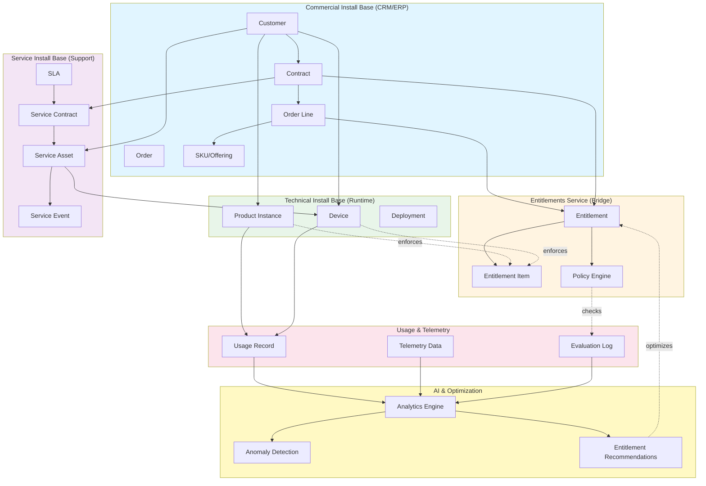

---

## Detailed Entity Relationship Diagram

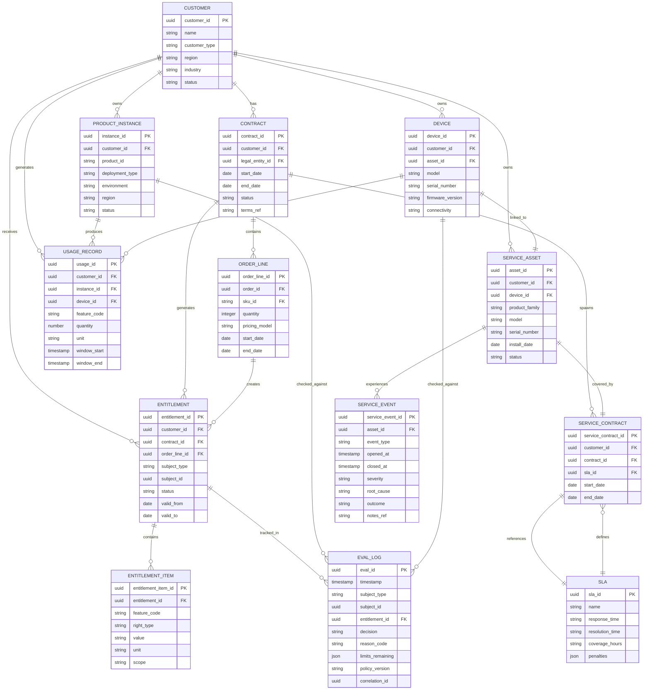

---

## Commercial Domain Detail

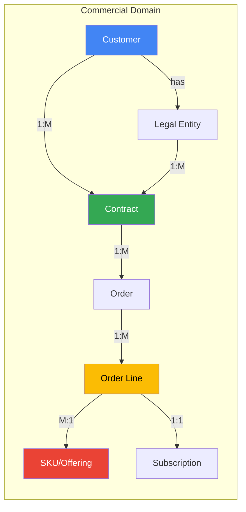

### Commercial to Entitlements Flow

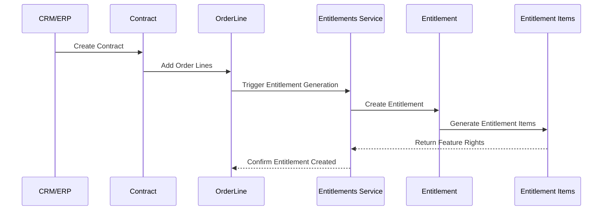

---

## Entitlements Domain Detail

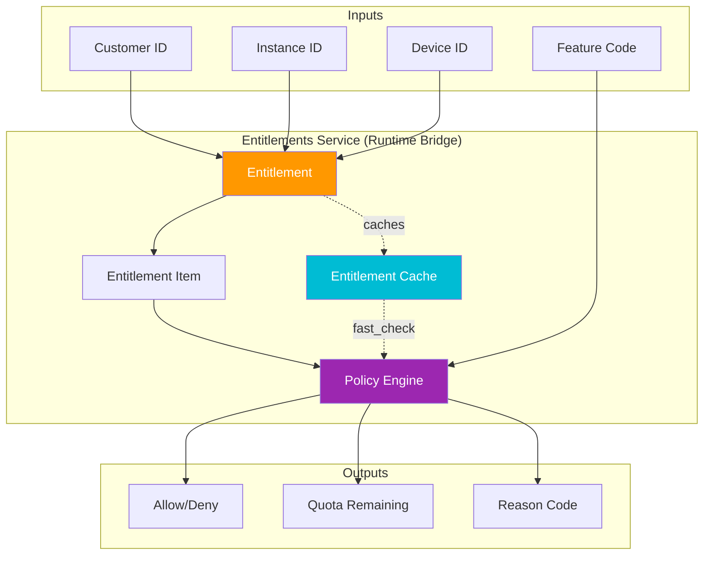

### Runtime Entitlement Check Flow

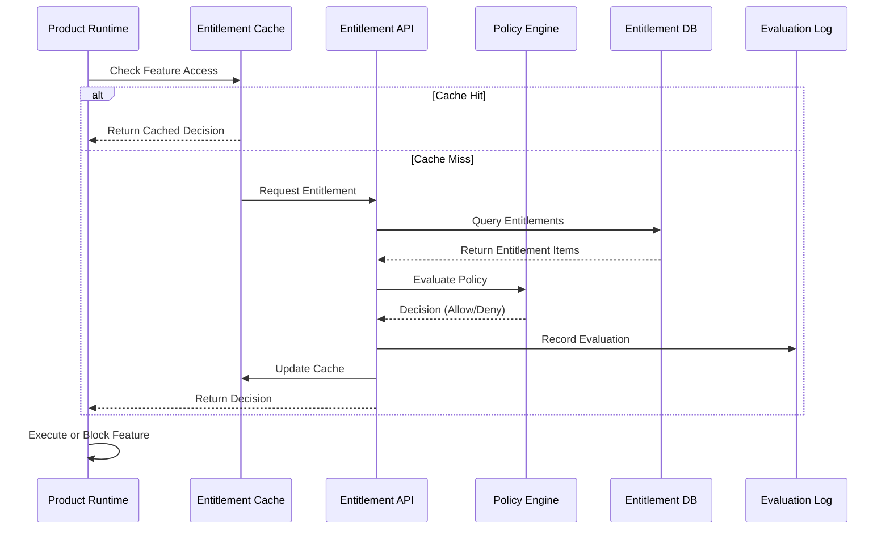

---

## Technical Domain Detail

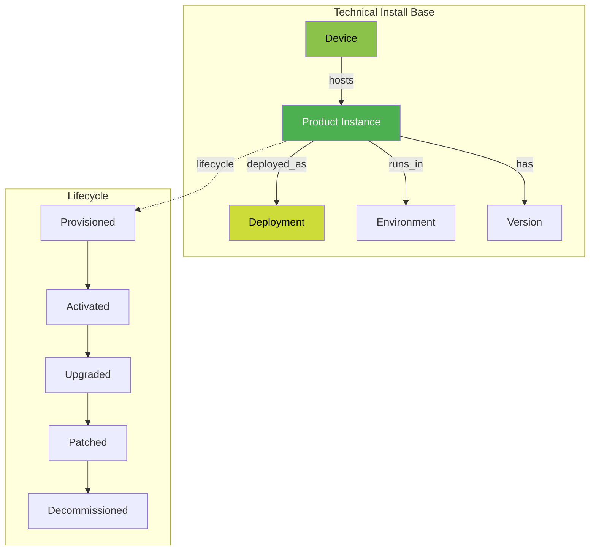

### Technical Instance Lifecycle

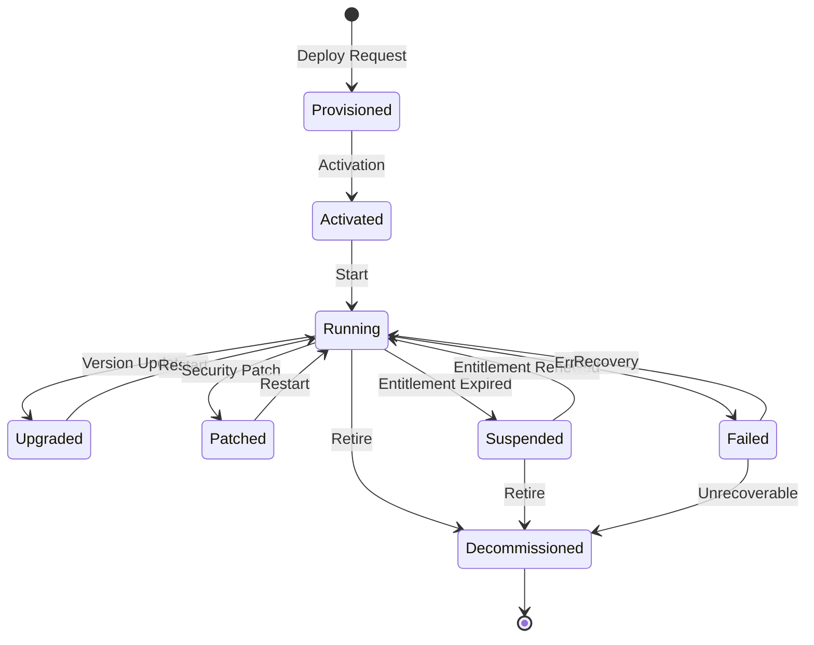

---

## Service Domain Detail

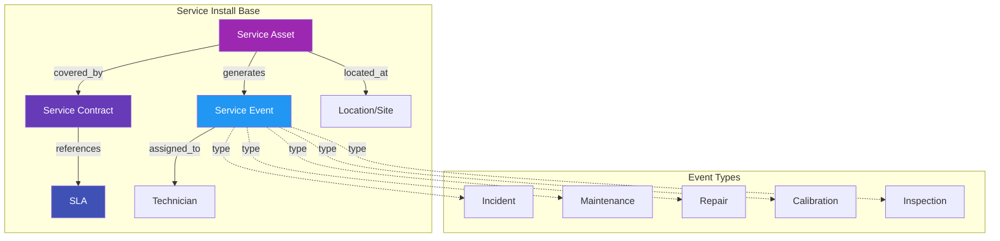

### Service Event Flow

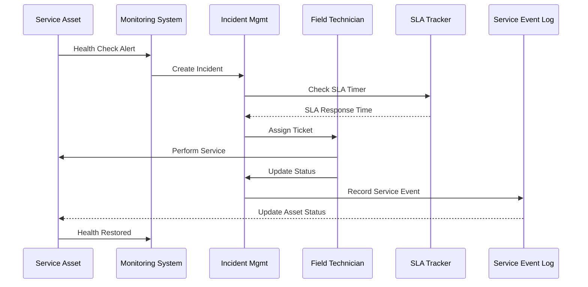

---

## Usage & Telemetry Flow

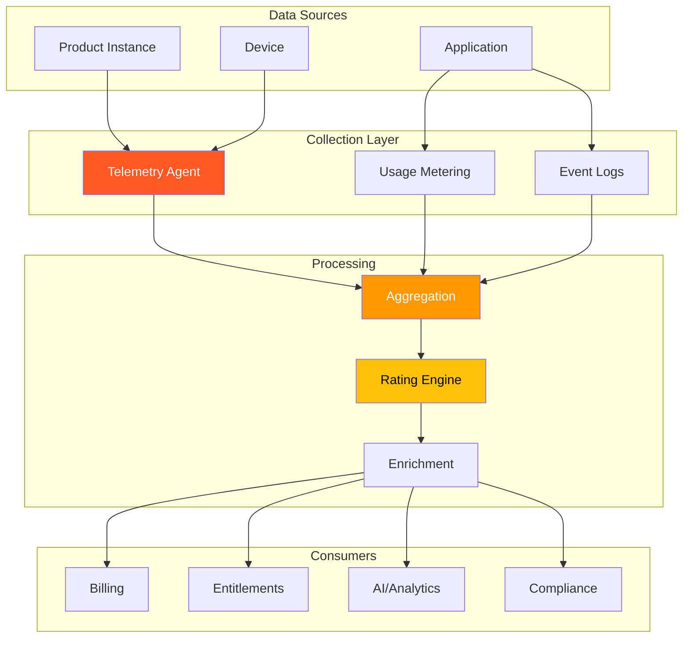

### Usage to Billing Flow

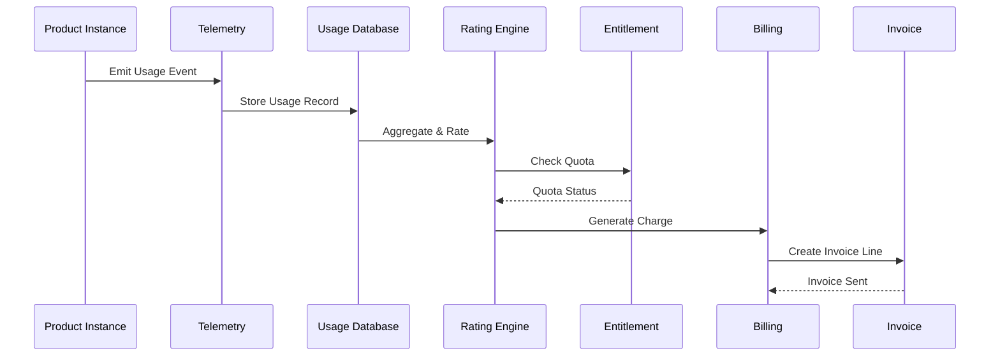

---

## AI & Optimization Layer

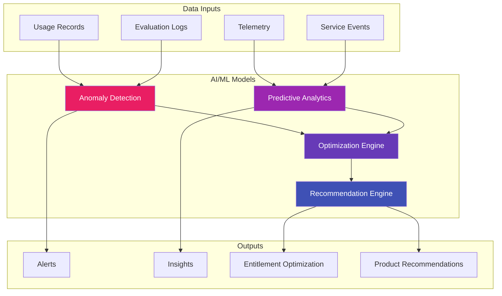

### AI-Driven Optimization Flow

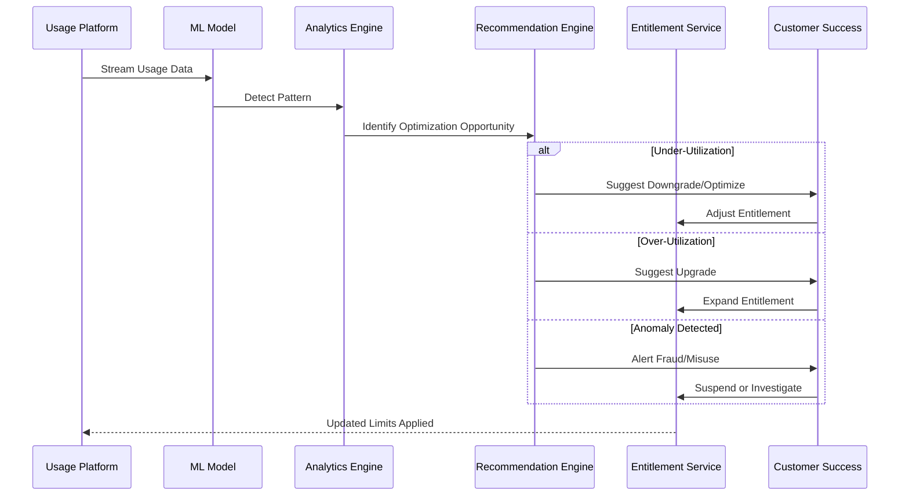

---

## Complete Data Flow: End-to-End

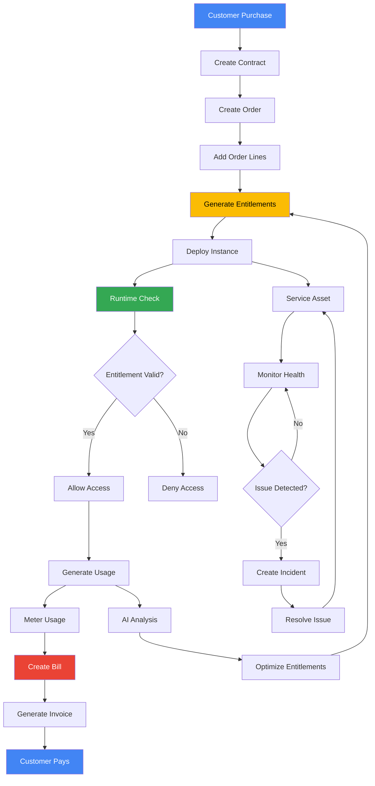

---

## Canonical Identifier Flow

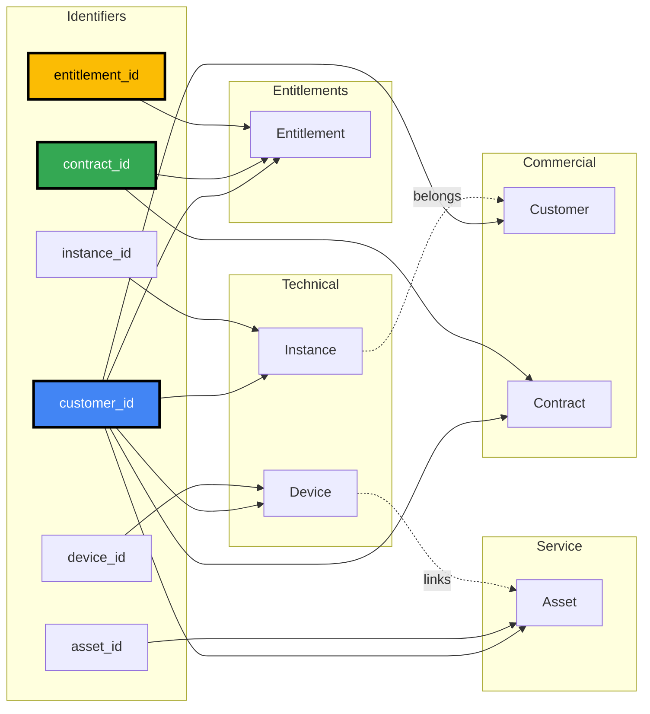

---

## Summary: Key Relationship Patterns

### 1. One-to-Many Relationships
- Customer → Contracts (1:M)
- Customer → Entitlements (1:M)
- Customer → Product Instances (1:M)
- Customer → Service Assets (1:M)
- Contract → Order Lines (1:M)
- Entitlement → Entitlement Items (1:M)
- Product Instance → Usage Records (1:M)
- Service Asset → Service Events (1:M)

### 2. Many-to-One Relationships
- Contracts → Customer (M:1)
- Entitlements → Contract (M:1)
- Product Instances → Customer (M:1)
- Usage Records → Product Instance (M:1)
- Service Events → Service Asset (M:1)

### 3. One-to-One Relationships
- Device ↔ Service Asset (1:1)
- Service Contract ↔ SLA (1:1)

### 4. Many-to-Many Relationships (via Junction Tables)
- Customers ↔ Products (via Contracts/Orders)
- Entitlements ↔ Features (via Entitlement Items)
- Service Assets ↔ Technicians (via Service Events)

---

## Diagram Legend

### Node Colors
- **Blue**: Commercial Domain
- **Orange/Yellow**: Entitlements Domain
- **Green**: Technical Domain
- **Purple**: Service Domain
- **Pink**: Usage & Telemetry
- **Light Yellow**: AI & Analytics

### Relationship Types
- **Solid Arrow** (→): Direct foreign key relationship
- **Dotted Arrow** (-.->): Logical/reference relationship
- **Bold Arrow** (==>): Primary data flow
- **Dashed Line** (--): Async/event-driven relationship

---

## How to Use These Diagrams

1. **For Developers**: Use the detailed ERD to understand database schema and foreign key relationships
2. **For Architects**: Use the high-level architecture to understand system boundaries and data flows
3. **For Product Managers**: Use the domain-specific diagrams to understand business processes
4. **For Operations**: Use the lifecycle and flow diagrams to understand runtime behavior
5. **For Security/Compliance**: Use the evaluation log and audit trail diagrams

---

## Next Steps

1. Implement database schema based on ERD
2. Design APIs following the data flow patterns
3. Set up event streaming for real-time updates
4. Implement caching strategy for entitlement checks
5. Build monitoring dashboards for each domain
6. Create data governance policies
7. Set up automated reconciliation between domains
